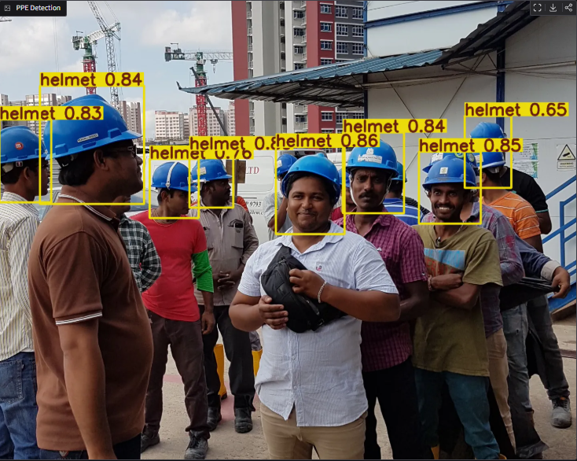

# 🦺 PPE Detector — Real-Time Helmet Detection with YOLOv8

A computer vision system that detects whether construction/factory workers are wearing a safety helmet, using a fine-tuned YOLOv8 model and an interactive Gradio web demo.


---

## 📸 Demo



The app accepts an image, runs inference with a custom-trained YOLOv8 model, and returns the image annotated with bounding boxes plus a detection summary. A confidence threshold slider lets the user adjust sensitivity in real time.

---

## 📊 Model Performance

The model was fine-tuned for 50 epochs on a Tesla T4 GPU (Google Colab), starting from YOLOv8s pretrained weights.

| Class    | Precision | Recall | mAP50 | mAP50-95 |
|----------|-----------|--------|-------|----------|
| head     | 0.924     | 0.895  | 0.941 | 0.634    |
| helmet   | 0.936     | 0.915  | 0.960 | 0.634    |
| **all**  | 0.620     | 0.603  | 0.642 | 0.427    |

> **Note:** the `person` class has very low performance (mAP50: 0.024) due to severe class imbalance in the training data (153 instances vs. 3,734 for `helmet`). It does not affect the core helmet/no-helmet detection task, which is the project's main goal.

---

## 🛠️ Tech Stack

- **Language:** Python
- **Detection model:** YOLOv8 (Ultralytics)
- **Image processing:** OpenCV
- **Training:** PyTorch, Google Colab (free GPU)
- **Web demo:** Gradio
- **Dataset:** [Hard Hat Detection](https://www.kaggle.com/datasets/andrewmvd/hard-hat-detection) (Kaggle, Pascal VOC format)

---

## 🚀 Running Locally

### 1. Clone the repository

```bash
git clone https://github.com/klrskevin1726/EppDetector.git
cd EppDetector
```

### 2. Create a virtual environment and install dependencies

```bash
python -m venv venv
venv\Scripts\activate        # Windows
# source venv/bin/activate   # macOS/Linux

pip install -r requirements.txt
```

### 3. Launch the demo

```bash
python app.py
```

Open the local URL shown in the terminal (usually `http://127.0.0.1:7860`).

---

## 📦 Reproducing the Training Pipeline

The trained model (`best.pt`) is included in this repo, so you don't need to retrain to run the demo. If you want to reproduce the training from scratch:

1. Download the [Hard Hat Detection dataset](https://www.kaggle.com/datasets/andrewmvd/hard-hat-detection) from Kaggle and extract it into `data/` (you should have `data/annotations/` and `data/images/`).
2. Run the conversion script to transform Pascal VOC XML annotations into YOLO format:
   ```bash
   python convert_dataset.py
   ```
   This generates `data/dataset/` with an 80/20 train/val split already organized for YOLOv8.
3. Upload `data/dataset/` to Google Drive and train using a Colab notebook with a GPU runtime:
   ```python
   from ultralytics import YOLO
   model = YOLO("yolov8s.pt")
   model.train(data="data.yaml", epochs=50, imgsz=640, batch=16)
   ```

---

## 📁 Project Structure

```
EppDetector/
├── main.py              # FastAPI REST API (production)
├── Dockerfile           # Container definition for cloud deployment
├── .dockerignore        # Files excluded from Docker image
├── app.py               # Gradio web demo
├── best.pt               # Trained YOLOv8 model weights
├── convert_dataset.py     # Pascal VOC XML -> YOLO format converter
├── explore_dataset.py     # Dataset class exploration script
├── test_my_model.py       # CLI script for quick inference testing
├── data.yaml              # YOLOv8 dataset config (classes, paths)
└── requirements.txt
```

---

## 🌐 Live API

The API is deployed and publicly accessible:

- **Health check:** https://eppdetector-production.up.railway.app/health
- **Interactive docs:** https://eppdetector-production.up.railway.app/docs
- **Predict endpoint:** POST https://eppdetector-production.up.railway.app/predict

## ⚠️ Known Limitations

- **Helmets held in hand vs. worn:** the model can produce false positives when a person is holding a helmet (e.g., in their hand) rather than wearing it, since this pattern was underrepresented in the training dataset. The model detects visual patterns near the head region rather than verifying the helmet is actually being worn.
- **No vest detection:** the source dataset only includes `head`, `helmet`, and `person` classes — there is no reflective vest annotation, so the current model cannot evaluate vest compliance.
- **Class imbalance:** the `person` class is underrepresented and performs poorly; it does not affect the helmet detection use case.

---

## 🔮 Possible Future Improvements

- Add a reflective vest detection class (would require a new annotated dataset or manual labeling)
- Real-time webcam inference with OpenCV
- Expand training data to include more "helmet not worn" edge cases (held in hand, on the ground, etc.)
- Deploy the demo publicly (Hugging Face Spaces or similar)

---

## 📄 License

This project is for educational and portfolio purposes. The dataset used is licensed under CC0 1.0 (Public Domain) via Kaggle.
